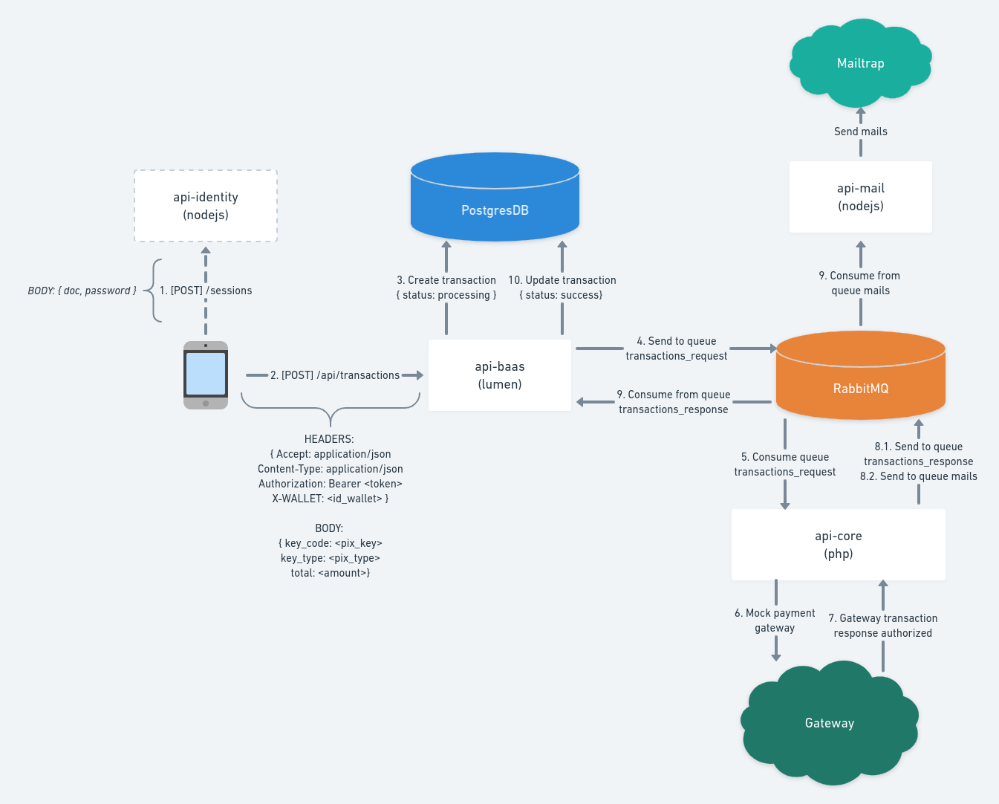

# Codepix - Banco Simplificado

O Codepix é uma API Rest que simula transferências pix para as carteiras virtuais de
lojistas e clientes comuns. A aplicação foi separada em 4 serviços (`api-baas`, 
`api-identity`, `api-core`, `api-mail`) que rodam em containers docker.

# Arquitetura



# Rodando a aplicação
Antes de rodar a aplicação é necessário criar uma conta no [Mailtrap](https://mailtrap.io/) e 
configurar o arquivo (chaves MAIL*) `.docker/api-mail.env` com as chaves de configuração.

Após configurado, basta executar o script `bootstrap.sh` para subir automagicamente (`docker-compose`) 
toda a infraestrutura de serviços.
```sh
$ ./bootstrap.sh
```
# Rest API
## Métodos
Requisições para a API devem seguir os padrões:
| Método | Descrição |
|---|---|
| `POST` | Utilizado para criar um novo registro. |

## Respostas

| Código | Descrição |
|---|---|
| `200` | Requisição executada com sucesso (success).|
| `201` | Recurso criado com sucesso (success).|
| `400` | Erros de validação ou os campos informados não existem no sistema.|
| `401` | Não autenticado.|
| `403` | Não autorizado.|
| `404` | Registro pesquisado não encontrado.|
| `422` | Erros de validação.|

## Autenticação
Nossa API utiliza [Json Web Tokens](https://jwt.io/) como forma de autenticação/autorização.
A criação dos tokens de acesso é de responsabilidade do serviço `api-identity`.

### Solicitar token de acesso
+ Endpoint: [POST] [api-identity-host]/sessions
+ Request (application/json)
    + Body
        ```json
            {
                "doc": "21540411419",
                "password": "123456",
            }
        ```
+ Response (application/json)
    + Body
        ```json
            {
                "id": "d295b2f1-75f0-4193-8854-50a05b771239",
                "search": "notebooks",
                "updatedAt": "2020-07-15T18:53:32.255Z",
                "createdAt": "2020-07-15T18:53:32.255Z",
                "total_results": 0,
                "total_searched": 0,
                "status": "processing"
            }
        ```

## Bank as service
A simulação de transferências para as carteiras virtuais de lojistas e clientes é de responsabilidade 
do serviço `api-baas`. Conforme pode ser visto no diagrama arquitetural, esse serviço se comunica
com toda a infraestrutura de banco de dados e filas.

### Simular transferência
+ Endpoint: [POST] [api-baas-host]/api/transactions
+ Request (application/json)
    + Headers
        ```sh
            Authotization: Bearer [token]
            X-WALLET: cc7d7281-d278-43bb-9aac-210a08893bad [id da carteira de origem]
        ```
    + Body
        ```json
            {
                "key_code": "mayer.mable@example.com",
                "key_type": "email",
                "total": 5000 //em centavos (equivale a R$50,00)
            }
        ```
+ Response (application/json)
    + Body
        ```json
            {
                "success": true,
                "message": "Created.",
                "data": {
                    "id": "0b8f9464-dbca-425d-a01f-94307d3bdd9b",
                    "wallet_from": "cc7d7281-d278-43bb-9aac-210a08893bad",
                    "wallet_to": "373232d6-8b49-44bc-8424-afce7e47316c",
                    "total": 5000,
                    "gateway_code": null,
                    "status": "processing", //o status irá modificar após ser processado pelos outros serviços (filas)
                }
            }
        ```

## Autor
Lucas Costa – [Linkedin](https://www.linkedin.com/in/lucashcruzcosta/) - [CodeSoftware](https://www.codesoftware.me)